### Overview

Kine implements naieve multi-version concurrency control on top of a traditional SQL database.
It stores all information in a single table; each row stores the revision, key, current value,
previous value, previous revision for this key, and flags indicating if the key was created or
deleted.

The revision or id is an auto-incrementing primary key, and kine attempts to ensure that no
events are missed by enforcing a strict monotonic sequencing of rows. If any gaps are observed,
dummy "fill" records are created to ensure that no other database clients can create a
conflicting event that would lag behind the current revision and cause potential inconsistency.

### Internals

The heart of Kine is a long-running polling goroutine that watches for new rows to be inserted
into the database. New rows are converted to events, sent through an unbuffered broadcaster for
fan-out, and from there go through a sequnce of buffered channels for filtering by prefix and
revision, and grouping into GRPC responses.

Create, Update, and Delete operations wake the polling goroutine to immediately alert it that
there are new rows. Rows inserted by other peers will be discovered by periodic polling.

Range (Get/List) operations directly query the database without interacting with the polling
goroutine.

Database compaction (pruning of deleted or replaced keys) is handled internally by Kine;
compaction requests via GRPC are acknowleged but not acted upon.

Lease/TTL is handled by a simple goroutine that watches all events, and places into a work
queue future removal of any keys that have a TTL. The TTL is checked again when the item is
dequeued, and the current TTL checked to see if removal is still due; if not it is rescheduled.

### Flow Diagram

```mermaid
flowchart LR
  subgraph kine ["Kine"]
    subgraph grpc-server ["GRPC Server"]
      subgraph grpc-txn ["Transaction"]
        grpc-create["Create"]
        grpc-update["Update"]
        grpc-delete["Delete"]
      end
      subgraph grpc-range["Range"]
        grpc-get["Get"]
        grpc-list["List"]
      end
      subgraph grpc-watch ["Watch Stream"]
        grpc-watch-create[\"CreateRequest"/]
        grpc-watch-response[/"WatchResponse"\]
      end
    end

    subgraph logstructured ["LogStructured"]
      logstructured-get("Get")
      logstructured-list("List")
      logstructured-create("Create")
      logstructured-update("Update")
      logstructured-delete("Delete")
      logstructured-watch("Watch")
    end

    subgraph sqllog ["SQLLog"]
      sqllog-append("Append")
      sqllog-list("List")
      sqllog-watch("Watch")
      sqllog-after("After")
      subgraph sqllog-poll ["Poll Loop"]
        sqllog-poll-timer("Timer")
        sqllog-poll-select("Select")
        sqllog-poll-events("Rows to Events")
      end
      subgraph broadcaster ["Broadcaster"]
        broadcaster-subscribe("Subscribe")
      end
    end
  end

  subgraph clients ["Clients"]
    kube-apiserver((("apiserver")))
    etcdctl((("etcdctl")))
  end

  subgraph database ["Database"]
    direction LR
    database-table[["table"]]
  end

  grpc-server --- clients
  sqllog ~~~~~~~~~~~~ database

  grpc-watch-create == "start" ===> logstructured-watch == "revision" ===> sqllog-watch == "prefix" ===> broadcaster-subscribe
  grpc-create --> logstructured-create --> sqllog-append
  grpc-update --> logstructured-update --> sqllog-append
  grpc-delete --> logstructured-delete --> sqllog-append
  grpc-get --> logstructured-get --> sqllog-list
  grpc-list --> logstructured-list --> sqllog-list

  sqllog-list -- "list query" ---------- database-table
  sqllog-append -- "insert returning revision" --- database-table
  sqllog-append -- "1a: notify revision" --> sqllog-poll-select
  sqllog-poll-timer -. "1b: tick" ..-> sqllog-poll-select
  sqllog-poll-select -."2: latest revision" ..-> sqllog-after -. "after query" ..- database-table
  sqllog-poll-select -. "3: []row" .-> sqllog-poll-events

  sqllog-poll-events -. "4 chan []event" .-> broadcaster-subscribe
  broadcaster-subscribe == "chan []event 100<br>prefix filter" ==> sqllog-watch
  logstructured-watch == "start revision" ==> sqllog-after == "after query" === database-table
  sqllog-watch == "chan []event 100<br>revision filter" ===> logstructured-watch
  logstructured-watch == "chan []event 100<br>batching" ===> grpc-watch-response

  click grpc-create href "https://github.com/k3s-io/kine/blob/master/pkg/server/create.go" _blank
  click grpc-update href "https://github.com/k3s-io/kine/blob/master/pkg/server/update.go" _blank
  click grpc-delete href "https://github.com/k3s-io/kine/blob/master/pkg/server/delete.go" _blank
  click grpc-get href "https://github.com/k3s-io/kine/blob/master/pkg/server/get.go" _blank
  click grpc-list href "https://github.com/k3s-io/kine/blob/master/pkg/server/list.go" _blank
  click grpc-watch-create href "https://github.com/k3s-io/kine/blob/master/pkg/server/watch.go#L70" _blank
  click grpc-watch-response href "https://github.com/k3s-io/kine/blob/master/pkg/server/watch.go#L119" _blank

  click logstructured-create href "https://github.com/k3s-io/kine/blob/master/pkg/logstructured/logstructured.go#L97" _blank
  click logstructured-update href "https://github.com/k3s-io/kine/blob/master/pkg/logstructured/logstructured.go#L222" _blank
  click logstructured-delete href "https://github.com/k3s-io/kine/blob/master/pkg/logstructured/logstructured.go#L129" _blank
  click logstructured-get href "https://github.com/k3s-io/kine/blob/master/pkg/logstructured/logstructured.go#L60" _blank
  click logstructured-list href "https://github.com/k3s-io/kine/blob/master/pkg/logstructured/logstructured.go#L171" _blank
  click logstructured-watch href "https://github.com/k3s-io/kine/blob/master/pkg/logstructured/logstructured.go#L432" _blank

  click sqllog-list href "https://github.com/k3s-io/kine/blob/master/pkg/logstructured/sqllog/sql.go#L274" _blank
  click sqllog-append href "https://github.com/k3s-io/kine/blob/master/pkg/logstructured/sqllog/sql.go#L529" _blank
  click sqllog-poll-select href "https://github.com/k3s-io/kine/blob/master/pkg/logstructured/sqllog/sql.go#L353" _blank
  click sqllog-poll-events href "https://github.com/k3s-io/kine/blob/master/pkg/logstructured/sqllog/sql.go#L402" _blank
  click sqllog-watch href "https://github.com/k3s-io/kine/blob/master/pkg/logstructured/sqllog/sql.go#L353" _blank

  click broadcaster-subscribe href "https://github.com/k3s-io/kine/blob/master/pkg/broadcaster/broadcaster.go#L16" _blank
```

### Flow Details

This section provides an overview of the sections listed in the block flow diagram above.

* Poll loop (logstructured/sqllog/sql.go)
  - Single goroutine started on demand by Broadcaster's ConnectFunc callback if broadcaster is not running when a new subscription is created
  - Queries for new rows inserted by other writers sharing the same backend database
  - Select is woken early by notify channel which suggests a new revision to check 
  - Creates fills if jumps in revision ID are observed - ensures that events observe a strict linear sequence without missing any rows
  - Converts `[]row` to `[]event` batch and sends to broadcaster channel  
    Broadcaster channel has no queue

* Broadcaster (broadcaster/broadcaster.go)
  - Single goroutine
  - Handles fan-out of events from database to watching clients
  - Starts poll loop if not running when a subscription is added
  - Read `[]event` batch from poll loop via broadcaster channel and sequentially sends to subscriber channels
  - If write to a subscriber would block due to its channel being full, the subscription is dropped (channel closed)  
    Subscriber channel buffer size is 100

* Watch (logstructured/sqllog/sql.go)
  - Goroutine per watch
  - Create new subscription from broadcaster - "drinking from the firehose" at this stage
  - Range reading batch of `[]event` from broadcaster subscription channel
  - Filter `[]event` in batch by watch prefix
  - Sends filtered `[]event` to logstructured Watch via result channel  
    Result channel buffer size is 100

* Watch (logstructured/logstructured.go)
  - Goroutine per watch
  - Create new sqllog Watch with prefix
  - Get `[]event` with prefix after selected revision (via sqllog.After) to find any rows that already exist, send to result channel
  - Range reading `[]event` batch from sqllog.Watch channel, filter by events since end of After (to avoid sending dupes), send to result channel  
    Result channel buffer size is 100

* Watch (server/watch.go)
  - Goroutine per watch
  - Create new logstructured Watch with prefix and revision
  - Read `[]event` from Watch channel until channel is drained, building larger []event list
    - Uses hybrid blocking initial / nonblocking continued select loop
    - Works around fact that local inserts always wake the poll loop immediately, with no opportunity for batching
    - Overhead of GRPC messaging is reduced if all queued events are batched before sending
  - Group collected `[]event` into WatchResponse and send to client
  - Watch continues sending response batches until watch is aborted by server, Cancel called by client, or client disconnects

* Append (logstructured/sqllog/sql.go)
  - Called from logstructured.Create/Delete/Update to add a new row
  - If insert is successful, sends the new revision into poll loop notify channel to wake it up and read the new row  
    Revision notify channel buffer size is 1024
